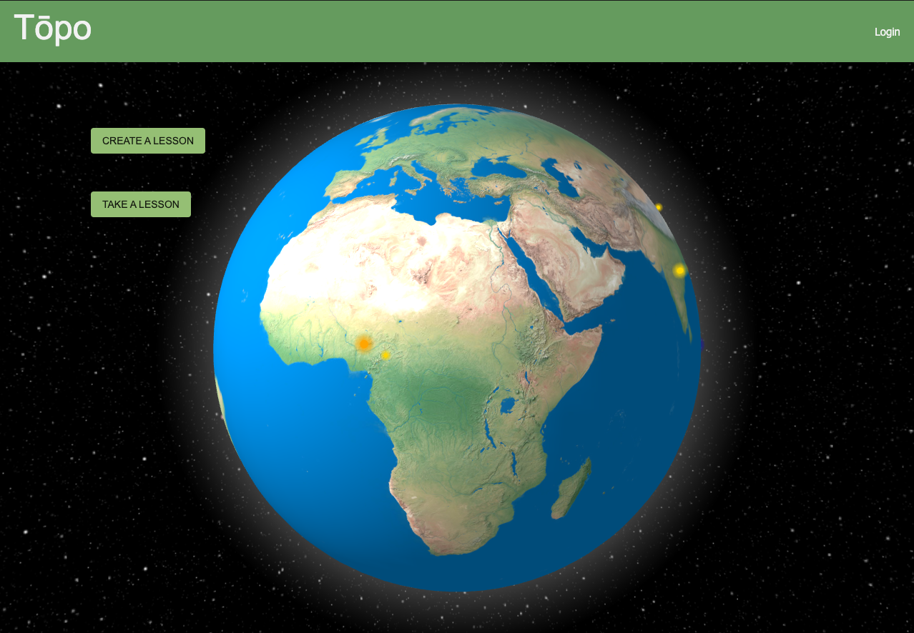
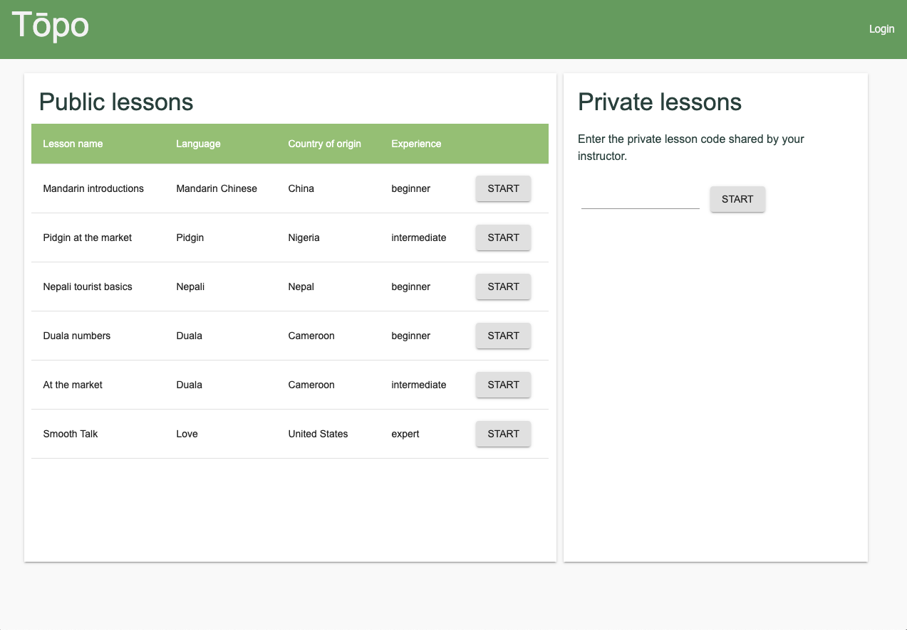
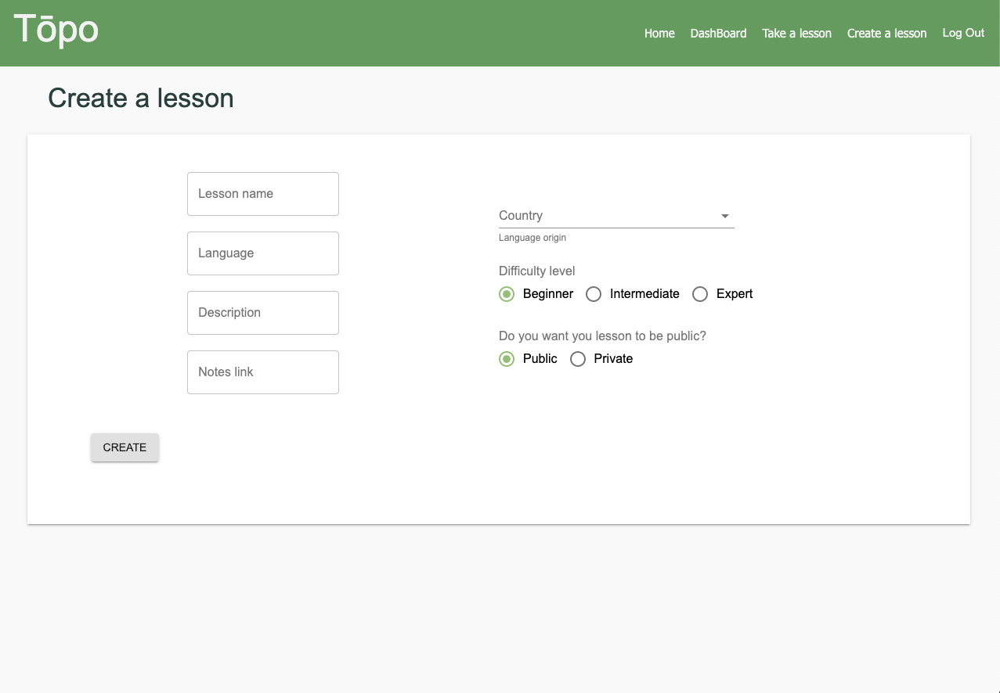

# readme-template

# Topo

## Description

_Duration: 4 Week Sprint_

Topo is a language-learning website for teachers of indigenous languages to share their language with students. Teachers can create, edit and manage lessons. Those lessons are then published on the site as public or private.  Anyone can create a lesson. Anyone can take a lesson. Preserve culture with Topo. 

To see the fully functional site, please visit: [Demo](https://polar-forest-38653.herokuapp.com/#/home)

### Prerequisites

- [Node.js](https://nodejs.org/en/)
- Node Package Manager 

## Installation

1. Create a database named `language_bank`,
2. The queries in the `tables.sql` file are set up to create all the necessary tables and populate the needed data to allow the application to run correctly. The project is built on [Postgres](https://www.postgresql.org/download/), so you will need to make sure to have that installed. We recommend using Postico to run those queries as that was used to create the queries, 
3. Open up your editor of choice and run an `npm install`
4. Run `npm run server` in your terminal
5. Run `npm run client` in your terminal
6. The `npm run client` command will open up a new browser tab for you!

## Usage

1. Instructors sign in or create an account
2. Then build a lesson by clicking create lesson in the nav bar 
3. Lesson can be edited from the lesson details page
4. Students are not required to sign in. Simply click take a lesson an begin 
5. If the lesson is private enter the private lesson code your instructor shared with you 

## Built With

1. React
2. JavaScript 
3. PostgreSQL 
4. Node + Express
5. React Bootstrap '
6. CSS 
7. HTML 
8. React Globe 
9. Material UI

## Acknowledgement
Thanks to [Prime Digital Academy](www.primeacademy.io) who equipped and helped me to make this application a reality.

## Support
If you have suggestions or issues, please email me at [malik.e1955@gmail.com](www.google.com)

## Screen Shot

